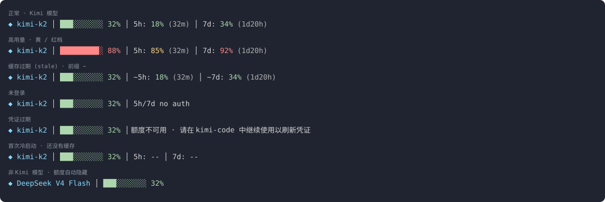

# kimi-dashboard

[](https://github.com/Win-Hao/kimi-dashboard/actions/workflows/ci.yml)
[](https://www.npmjs.com/package/kimi-dashboard)
[](LICENSE)

> **非 Moonshot 官方项目 · Not an official Moonshot project.**
> 只读取 kimi-code 已有的凭证与接口，不修改 kimi-code 的任何行为。

把 Kimi Code 的官方额度（5h / 7d / 加油包）、context、模式、分支、会话信息常驻在 kimi-code 底栏第一行——不用再敲 `/usage`。
Kimi Code quota (5h / 7d / booster), context and session info, always visible in the kimi-code footer.



```
◆ K3 │ ███░░░░░░░ 32% │ 62.5k/195k │ 5h: 18% (32m) │ 7d: 34% (1d20h) │ ⚡ ¥42.00 │ 💰 ¥58.00/¥200.00 │ auto │ 🌿 main │ 📁 kimi-dashboard │ ⏱ 1h5m │ v0.39.0
```

[中文](#中文) · [English](#english)

---

## 中文

### 安装

**作为 kimi-code 插件（推荐）**——在 kimi-code 里：

```text
/plugins install https://github.com/Win-Hao/kimi-dashboard
/reload
/kimi-dashboard:setup
```

`setup` 会弹出布局（Full / Compact / Quota / Custom）和语言（自动 / 中文 / English）选择，写好配置并把 `~/.kimi-code/tui.toml` 的 `status_line.command` 指向插件自带的 `dist/cli.js`——不依赖 PATH，不依赖 npm。之后每次会话启动 `SessionStart` hook 会自动保持接线；tui.toml 里已有别人的自定义命令时不会覆盖，要替换请 `/kimi-dashboard:setup --force`。

| 斜杠命令 | 作用 |
|---|---|
| `/kimi-dashboard:setup [full\|compact\|quota\|key=value…] [--force]` | 选择显示内容和语言并接线；不带参数弹出布局与语言选择 |
| `/kimi-dashboard:doctor` | 自检：凭证 / 缓存 / 配置 / 连通性 |
| `/kimi-dashboard:preview` | 用假数据预览各种状态，不联网 |

**用 npm**：

```sh
npm i -g kimi-dashboard
kimi-dashboard setup       # 写入 ~/.kimi-code/tui.toml
kimi-dashboard doctor      # 自检
```

然后在 kimi-code 里 `/reload`。第一次冷启动的一两秒底栏先显示 `5h: -- │ 7d: --`，缓存热了就是真实数字。
没有全局安装时用 `kimi-dashboard setup --command "node /绝对路径/dist/cli.js statusline"`。

### 显示什么

12 个段位，按 `segments` 里写的顺序显示：

| 段位 | 显示 | 数据来源 |
|---|---|---|
| `model` | `◆ K3` | kimi-code |
| `ctx` | `███░░░░░░░ 32%` context 占用 | kimi-code |
| `tokens` | `62.5k/195k` context 窗口已用 / 上限 token（和 `ctx` 同一数据，另一种画法） | kimi-code |
| `5h` | `5h: 18% (32m)` 5 小时额度 + 重置倒计时 | `/usages` |
| `7d` | `7d: 34% (1d20h)` 周额度 + 重置倒计时 | `/usages` |
| `booster` | `⚡ ¥42.00` 加油包余额（未启用不显示） | `/usages` |
| `spend` | `💰 ¥58.00/¥200.00` 加油包本月消费 / 月上限 | `/usages` |
| `mode` | `auto` / `yolo` / `plan`（默认模式不显示） | kimi-code |
| `git` | `🌿 main` 分支 | kimi-code |
| `cwd` | `📁 kimi-dashboard` 目录名（home 显示 `~`） | kimi-code |
| `session` | `⏱ 1h5m` 本次会话时长 | 本地记录 |
| `version` | `v0.39.0` kimi-code 版本 | kimi-code |

- 百分比按档变色：<60% 绿，60–85% 黄，>85% 红；`(32m)` 是距离窗口重置的时间
- 用 DeepSeek 等其他服务商的模型时，Kimi 额度段位（5h / 7d / booster / spend）自动隐藏
- 宽度不够时从右往左裁：`version → session → cwd → git → mode → spend → booster → tokens → model → ctx → 7d`，`5h` 永不裁；终端 < 60 列（按 `$COLUMNS`，缺省 120）只留 `5h`
- `NO_COLOR` 或 `TERM=dumb`：纯文本，`#`/`-` 进度条，`|` 分隔，不带图标

| 状态 | 底栏 |
|---|---|
| 缓存超过 10 分钟没刷新 | `~5h: 18% (32m) │ ~7d: …` |
| 还没有缓存 | `5h: -- │ 7d: --` |
| 没有凭证 | `5h/7d no auth` |
| 凭证过期且没有旧数据 | `额度不可用 · 请在 kimi-code 中继续使用以刷新凭证`（英文环境：`quota unavailable · keep using kimi-code to refresh the login`） |
| stdin 非法 / 内部异常 | 输出空行，kimi-code 回落到内置底栏 |

### 怎么改

不用手写 TOML：

```sh
kimi-dashboard config                            # 看当前配置 + 预览行
kimi-dashboard config --preset compact           # full（默认，全部 12 段）/ compact / quota
kimi-dashboard config segments=model,5h,7d,git quotaStyle=bar separator=dot
```

插件用户等价于 `/kimi-dashboard:setup compact`、`/kimi-dashboard:setup segments=…` 或 `/kimi-dashboard:setup lang=zh`。改完 1 秒内生效，不用重启。
预设：`compact` = model ctx tokens 5h 7d；`quota` = 5h 7d booster spend mode git。

| 键 | 默认 | 说明 |
|---|---|---|
| `segments` | 全部 12 段 | 显示哪些段、什么顺序 |
| `quotaStyle` | `text` | `bar` 则 5h/7d 画成 `5h ██░░░░░░░░ 18% (32m)` |
| `separator` | `pipe` | `│` · `dot` `·` · `arrow` `›` · `space` |
| `showReset` | `true` | 额度后的 `(32m)` 倒计时 |
| `icons` | `true` | ◆ 🌿 📁 ⚡ 💰 ⏱ |
| `barWidth` | `10` | 进度条格数 |
| `ascii` | `false` | 强制纯文本 |
| `quotaWhenNotKimi` | `hide` | `show` 则用其他服务商时也显示 Kimi 额度 |
| `refreshIntervalMs` | `120000` | 额度缓存 TTL |
| `staleAfterMs` | `600000` | 超过则加 `~` |
| `lang` | `auto` | 底栏提示语言 `zh` / `en`；`auto` 按系统 `$LANG`；不带参数的 `/kimi-dashboard:setup` 会问。斜杠命令会用你说话的语言回复 |

配置文件 `~/.config/kimi-dashboard/config.toml`（`$XDG_CONFIG_HOME` 可改），也可以手改；缓存在 `~/.cache/kimi-dashboard/`。
`KIMI_CODE_HOME`、`KIMI_CODE_BASE_URL` 与 kimi-code 同义。

### 已知限制

- **只有一行。** kimi-code 只采用自定义命令 stdout 的第一行，底栏第二行（右侧的 `context: 3% (…)`）由宿主写死，关不掉，也无法多行——所以 `ctx` 段位和第二行显示的是同一个数字，不想重复就把 `ctx` 从 `segments` 去掉。多行需要上游改动，见 [MoonshotAI/kimi-code#2448](https://github.com/MoonshotAI/kimi-code/issues/2448)、[#2435](https://github.com/MoonshotAI/kimi-code/issues/2435)。
- **终端宽度靠猜。** kimi-code 不把终端宽度传给命令，裁剪按 `$COLUMNS`（缺省 120）；再窄的部分由宿主从右截断。

### 工作方式与安全

- kimi-code 每次重绘底栏都会执行 `statusline`（最快每秒一次，300ms 超时）。热路径**只读本地缓存**，永不联网，冷启动 p99 ≈ 30ms。
- 缓存过期时 detach 一个后台 `refresh` 进程请求 `GET /usages` 写回缓存；多个窗口并发靠 `refresh.lock` 去重；不用 kimi-code 时没有任何常驻进程。
- 对 `~/.kimi-code/credentials/` **只读，永不写、永不刷新 token**：只取 `access_token` 与 `expires_at`，`refresh_token` 不进内存、不进日志；token 剩余不足 60s 视为过期，等 kimi-code 自己刷新。测试断言凭证目录 `chmod 0500` 依然可用且文件字节不变。

### 命令

```
kimi-dashboard statusline   从 stdin 读 payload，输出一行（供 kimi-code 调用）
kimi-dashboard config       查看 / 修改显示内容            [--preset full|compact|quota] [key=value …]
kimi-dashboard setup        写 tui.toml 的 status_line     [--self] [--force] [--quiet] [--command "<cmd>"]
kimi-dashboard doctor       自检
kimi-dashboard preview      假数据预览，不联网            [--hot] [--stale] [--no-auth] [--expired] [--empty] [--not-kimi] [--bar] [--ascii] [--width N] [--color]
kimi-dashboard refresh      刷一次额度写缓存              [--json]
kimi-dashboard daemon       可选常驻刷新                  [--interval-ms N] [--verbose]
kimi-dashboard lang         打印应使用的语言 zh|en（配置 lang，否则 $LANG）
```

---

## English

### Install

**As a kimi-code plugin (recommended)** — inside kimi-code:

```text
/plugins install https://github.com/Win-Hao/kimi-dashboard
/reload
/kimi-dashboard:setup
```

`setup` asks for a layout (Full / Compact / Quota / Custom) and a language (Auto / 中文 / English), writes the config and points `status_line.command` in `~/.kimi-code/tui.toml` at the bundled `dist/cli.js` — no PATH, no npm. A `SessionStart` hook keeps it wired on every session; an existing foreign command is never overwritten (use `/kimi-dashboard:setup --force`).

| Slash command | Does |
|---|---|
| `/kimi-dashboard:setup [full\|compact\|quota\|key=value…] [--force]` | choose what to show and the language, then wire the footer; no arguments → interactive picker |
| `/kimi-dashboard:doctor` | credential / cache / config / connectivity check |
| `/kimi-dashboard:preview` | render every state from sample data, offline |

**With npm**:

```sh
npm i -g kimi-dashboard
kimi-dashboard setup       # writes ~/.kimi-code/tui.toml
kimi-dashboard doctor      # self-check
```

Then `/reload` in kimi-code. The first second shows `5h: -- │ 7d: --` while the cache warms up.
Without a global install: `kimi-dashboard setup --command "node /abs/path/dist/cli.js statusline"`.

### What it shows

12 segments, rendered in the order listed in `segments`:

| Segment | Shows | Source |
|---|---|---|
| `model` | `◆ K3` | kimi-code |
| `ctx` | `███░░░░░░░ 32%` context usage | kimi-code |
| `tokens` | `62.5k/195k` context window tokens used / max (same data as `ctx`, as numbers) | kimi-code |
| `5h` | `5h: 18% (32m)` 5-hour window + reset countdown | `/usages` |
| `7d` | `7d: 34% (1d20h)` weekly window + reset countdown | `/usages` |
| `booster` | `⚡ ¥42.00` booster balance (hidden when not enabled) | `/usages` |
| `spend` | `💰 ¥58.00/¥200.00` booster spend this month / monthly limit | `/usages` |
| `mode` | `auto` / `yolo` / `plan` (hidden in the default mode) | kimi-code |
| `git` | `🌿 main` branch | kimi-code |
| `cwd` | `📁 kimi-dashboard` directory name (`~` at home) | kimi-code |
| `session` | `⏱ 1h5m` session duration | recorded locally |
| `version` | `v0.39.0` kimi-code version | kimi-code |

- Percentages are colour-banded: <60 % green, 60–85 % yellow, >85 % red; `(32m)` is the time until the window resets
- While a non-Kimi provider's model is active (e.g. DeepSeek) the Kimi quota segments (5h / 7d / booster / spend) hide themselves
- When the line does not fit, segments drop from the tail: `version → session → cwd → git → mode → spend → booster → tokens → model → ctx → 7d`; `5h` never drops; under 60 columns (from `$COLUMNS`, default 120) only `5h` remains
- `NO_COLOR` or `TERM=dumb`: plain text, `#`/`-` bars, `|` separators, no icons

| State | Footer |
|---|---|
| cache older than 10 min | `~5h: 18% (32m) │ ~7d: …` |
| no cache yet | `5h: -- │ 7d: --` |
| no credential | `5h/7d no auth` |
| expired credential, no old data | `quota unavailable · keep using kimi-code to refresh the login` (Chinese locale: `额度不可用 · 请在 kimi-code 中继续使用以刷新凭证`) |
| invalid stdin / internal error | empty line → kimi-code falls back to its built-in footer |

### How to change it

No hand-written TOML needed:

```sh
kimi-dashboard config                            # current config + a preview line
kimi-dashboard config --preset compact           # full (default, all 12) / compact / quota
kimi-dashboard config segments=model,5h,7d,git quotaStyle=bar separator=dot
```

Plugin users: `/kimi-dashboard:setup compact`, `/kimi-dashboard:setup segments=…` or `/kimi-dashboard:setup lang=zh`. Changes apply within a second.
Presets: `compact` = model ctx tokens 5h 7d; `quota` = 5h 7d booster spend mode git.

| Key | Default | Meaning |
|---|---|---|
| `segments` | all 12 | which segments, in which order |
| `quotaStyle` | `text` | `bar` renders `5h ██░░░░░░░░ 18% (32m)` |
| `separator` | `pipe` | `│` · `dot` `·` · `arrow` `›` · `space` |
| `showReset` | `true` | the `(32m)` countdown after each window |
| `icons` | `true` | ◆ 🌿 📁 ⚡ 💰 ⏱ |
| `barWidth` | `10` | bar cells |
| `ascii` | `false` | force plain text |
| `quotaWhenNotKimi` | `hide` | `show` keeps the Kimi quota visible for other providers |
| `refreshIntervalMs` | `120000` | quota cache TTL |
| `staleAfterMs` | `600000` | older data gets the `~` prefix |
| `lang` | `auto` | language of the footer hint, `zh` / `en`; `auto` follows `$LANG`; `/kimi-dashboard:setup` without arguments asks for it. The slash commands answer in whatever language you write in |

Config lives in `~/.config/kimi-dashboard/config.toml` (`$XDG_CONFIG_HOME` honoured) and can be edited by hand; the cache is in `~/.cache/kimi-dashboard/`.
`KIMI_CODE_HOME` and `KIMI_CODE_BASE_URL` mean what they mean to kimi-code.

### Known limits

- **One line only.** kimi-code uses just the first stdout line of a custom status command; footer line 2 (the `context: 3% (…)` on the right) is hard-coded by the host and cannot be hidden or replaced — so `ctx` shows the same number twice; drop `ctx` from `segments` if that bothers you. Multi-line output needs an upstream change: [MoonshotAI/kimi-code#2448](https://github.com/MoonshotAI/kimi-code/issues/2448), [#2435](https://github.com/MoonshotAI/kimi-code/issues/2435).
- **Terminal width is a guess.** kimi-code does not pass it; trimming uses `$COLUMNS` (default 120) and the host cuts anything wider.

### How it works & credential safety

- kimi-code runs `statusline` on every footer repaint (at most once a second, 300 ms budget). The hot path **only reads a local cache file** — never the network; cold start p99 ≈ 30 ms.
- When the cache is older than the refresh interval, a detached background `refresh` process does `GET /usages` and rewrites the cache; concurrent windows are de-duplicated with `refresh.lock`; no process lives while kimi-code is closed.
- `~/.kimi-code/credentials/` is **read-only for this tool: never written, tokens never refreshed**. Only `access_token` and `expires_at` are read; `refresh_token` never enters a variable or a log. A token with < 60 s left counts as expired and kimi-code is left to refresh it. Tests assert a `chmod 0500` credentials directory still works and stays byte-for-byte identical.

### Commands

```
kimi-dashboard statusline   read the payload from stdin, print one line (called by kimi-code)
kimi-dashboard config       show / change what the line displays   [--preset full|compact|quota] [key=value …]
kimi-dashboard setup        write status_line into tui.toml        [--self] [--force] [--quiet] [--command "<cmd>"]
kimi-dashboard doctor       self-check
kimi-dashboard preview      sample data, offline                   [--hot] [--stale] [--no-auth] [--expired] [--empty] [--not-kimi] [--bar] [--ascii] [--width N] [--color]
kimi-dashboard refresh      fetch quota once and write the cache   [--json]
kimi-dashboard daemon       optional resident refresher            [--interval-ms N] [--verbose]
kimi-dashboard lang         print the language to use, zh|en (config lang, else $LANG)
```

### Development

```sh
npm install
npm test            # vitest: pure functions, filesystem, loopback HTTP, and e2e through dist/cli.js
npm run build       # tsup → dist/cli.js (single dependency-free ESM file)
npm run bench       # cold-start p99 guard (< 150 ms)
npm run preview:html  # docs/preview.html + docs/preview.svg
```

`dist/cli.js` is committed on purpose: kimi-code installs plugins straight from the GitHub archive, so the bundle must be in the repo; CI fails if it is stale. Node ≥ 20. MIT.
